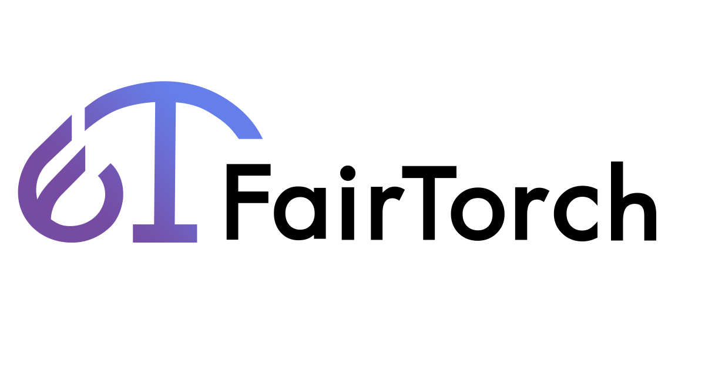

.. fairtorch documentation master file, created by
   sphinx-quickstart on Sat May 22 19:07:06 2021.
   You can adapt this file completely to your liking, but it should at least
   contain the root `toctree` directive.

.. FairTorch 

=====================================

.. toctree::
   :maxdepth: 2
   :caption: Contents:

=====================================

.. * :ref:`genindex`
.. * :ref:`modindex`
.. * :ref:`search`

FairTorch won 1st prize at `the Global PyTorch Summer Hackathon 2020`_, Responsible AI section.
PyTorch implementation of parity loss as constraints function to realize the fairness of machine learning.
Demographic parity loss and equalied odds loss are available.

This project is a part of `PyTorch Summer Hackathon 2020`_. visit our `project page`_.

.. _the Global PyTorch Summer Hackathon 2020: https://pytorch.org/blog/announcing-the-winners-of-the-2020-global-pytorch-summer-hackathon/#pytorch-responsible-ai-development-tools
.. _PyTorch Summer Hackathon 2020: https://pytorch2020.devpost.com/
.. _project page: https://devpost.com/software/a-qeysp1

=====================
Usage
=====================

.. code-block:: python

   dp_loss = DemographicParityLoss(sensitive_classes=[0, 1], alpha=100)
   criterion = nn.BCEWithLogitsLoss()

   .
   .
   .  

   logit = model(x_train)
   loss = criterion(logit.view(-1), y_train)
   loss = loss + dp_loss(x_train, logit, sensitive_features)

=====================
Install
=====================

pip version
===============

.. code-block:: python

   pip install fairtorch

newest version
===============

.. code-block:: python

   git clone https://github.com/MasashiSode/fairtorch
   cd fairtorch
   pip install .

=====================
Background
=====================
In recent years, machine learning-based algorithms and softwares have rapidly spread in society. However, cases have been found where these algorithms unintentionally suggest discriminatory decisions[1]. For example, allocation harms can occur when AI systems extend or withhold opportunities, resources, or information. Some of the key applications are in hiring, school admissions, and lending[2]. Since Pytorch didn't have a library to achieve fairness yet, we decided to create one.

=====================
What it does
=====================
Fairtorch provides tools to mitigate inequities in classification and regression. Classification is only available in binary classification. A unique feature of this tool is that you can add a fairness constraint to your model by simply adding a few lines of code.

========================
Challenges we ran into
========================
In the beginning, we attempted to develop 'FairTorch'_ based on the Fairlearn[3]’s reduction algorithm. However, it was implemented based on scikit-learn and was not a suitable algorithm for deep learning. It requires ensemble training of the model, which would be too computationally expensive to be used for deep learning. To solve that problem, we implemented a constrained optimization without ensemble learning to fit the existing Fairlearn algorithm for deep learning.

.. _'FairTorch': https://github.com/fairlearn/fairlearn

